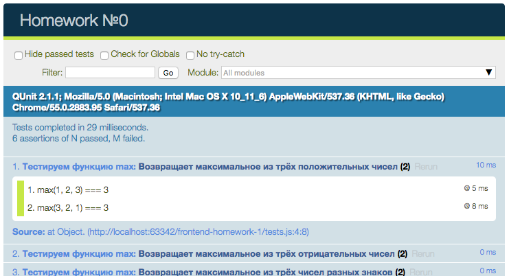

# frontend-homework-9
#### Simple homework for students №9

В этом репозитории содержится условие варианта №9 домашнего задания. Чтобы начать с ним работать, вам необходимо склонировать репозиторий к себе на компьютер и перейти в ветку своего варианта.


## Условие
Мы написали юнит-тесты на некоторую функцию, но саму функцию не реализовали. Вам необходимо реализовать эту функцию, а так же написать для неё парочку дополнительных тестов. Готовое решение необходимо закоммитить, запушить и отправить нам пулл-реквест с кодом. Не забудьте подписаться!

За это ДЗ можно получить до 5 баллов. Оцениваться будет качество и оптимальность кода. Чтобы получить максимальный балл, необходимо реализовать функцию так, чтобы проходили все тесты. Чтобы лучше понять требования к задаче, рекомендуется так же смотреть тесты.

#### Задание:

Напишите функцию `removeDuplicateLettersBegin`, которая будет искать повторяющиеся символы в строках и удалять их, оставляя на месте только первую встречающуюся букву

## Файлы
В репозитории содержатся следующие файлы:

- `index.html` &mdash; главный файл. Для запуска тестов, необходимо открыть его в браузере
- `source/max.js` &mdash; файл с реализацией функции `max()`
- `tests/max.js` &mdash; файл с тестами к функции `max()`

На страницу `index.html` подключена библиотека jQuery и библиотека для юнит-тестирования [QUnit](https://qunitjs.com/). На официальном сайте QUnit присутствуют примеры тестов и описание функций, которые присутствуют в библиотеке.

Если вы сейчас откроете `index.html` в браузере, вы увидите такую картинку:



Несколько тестов пройдены, но основная часть &mdash; падает с ошибками. Вам нужно сделать так, чтобы все тесты были "зелёными".

## Пример
В качестве примера, мы реализовали функцию max, которая принимает на вход массив из трёх чисел и возвращает максимальное из них. Для этого в папке `source` мы создали файл `max.js` и подключили его на страницу. Для всех остальных функций я советую вам так же создавать отдельный файл. Так ваш код становится чище и аккуратнее и вашим коллегам становится проще в нём разбираться.

Давайте посмотрим на наш тест:
```javascript
QUnit.module('Тестируем функцию max', function () {
	QUnit.test('Возвращает максимальное из трёх положительных чисел', function (assert) {
		assert.strictEqual(max([1, 2, 3]), 3, 'max([1, 2, 3]) === 3');
		assert.strictEqual(max([3, 2, 1]), 3, 'max([3, 2, 1]) === 3');
	});

	QUnit.test('Возвращает максимальное из трёх отрицательных чисел', function (assert) {
		assert.strictEqual(max([-1, -2, -3]), -1, 'max([-1, -2, -3]) === -1');
		assert.strictEqual(max([-3, -2, -1]), -1, 'max([-3, -2, -1]) === -1');
	});

	QUnit.test('Возвращает максимальное из трёх чисел разных знаков', function (assert) {
		assert.strictEqual(max([-1, 0, 1]), 1, 'max([-1, 0, 1]) === 1');
		assert.strictEqual(max([1, 0, -1]), 1, 'max([1, 0, -1]) === 1');
	});
});
```

В строке `QUnit.module('Тестируем функцию max', ...` мы создаём группу тестов, далее с помощью фунции `QUnit.test` мы создаём отдельные тесты. В одном из тестов мы проверяем, правильно ли работает наша функция с положительными числами.

Строка
```javascript
assert.strictEqual(max([1, 2, 3]), 3, 'max([1, 2, 3]) === 3');
```

содержит вызов специальной функции `assert.strictEqual`, которая проверяет на равенство значение, возвращаемое функцией `max` и ожидаемый правильный ответ. В качестве третьего аргумента в функцию передаётся текстовое описание проверки. Если проверка сфейлится, то соответствующий тест не пройдёт.

Аналогичным образом написаны и остальные тесты в группе.

#### Реализация функции max
Давайте попробуем реализовать функцию `max` так, чтобы она правильно работала. Для этого добавляем в файл `source/max.js` следующий код (думаю, вам не составит труда понять его):

```javascript
const max = function (numbers) {
    const a = numbers[0];
    const b = numbers[1];
    const c = numbers[2];
	if (a > b) {
		if (a > c) {
			return a
		}
		return c
	}
	if (b > c) {
		return b
	}
	return c
};
```

Этот код делает то, что нужно и с ним наши тесты проходят, но он выглядит очень сложно и запутанно. Попробуем его улучшить с помощью использования встроенной в JavaScript функции `Math.max()`:

```javascript
const max = function (numbers) {
	return Math.max.apply(null, numbers);
};
```

Здесь нам пришлось использовать метод `Math.max.apply`, т.к. функция `Math.max()` принимает на вход не массив чисел, а отдельные числа. Такой код прекрасно работает, но его можно сделать ещё проще, если использовать оператор spread:

```javascript
const max = function (numbers) {
	return Math.max(...numbers);
};
```

Именно так реализовало бы её большинство разработчиков и именно это решение самое оптимальное и лаконичное. Стоит заметить, что такая реализация функции `max()` позволяет вызывать с массивами вообще с любым количеством аргументов: результат всегда будет правильный. Именно за такое решение можно получить максимальный балл.

__Желаю вам успехов!!!__
#
